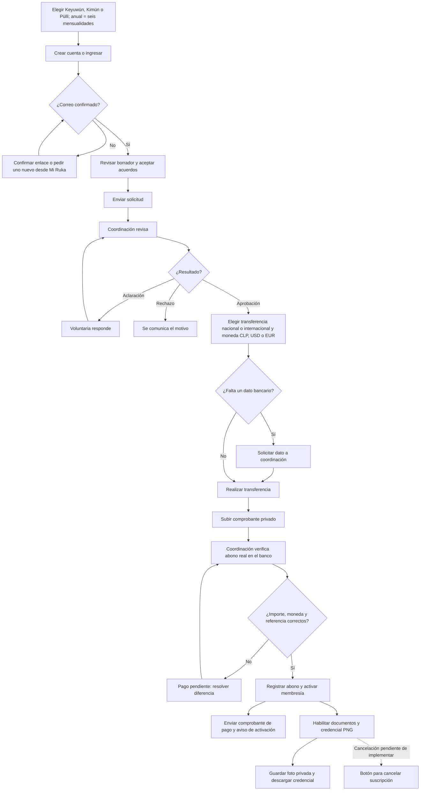

# Diagrama del flujo de voluntariado

Este diagrama acompaña al [manual de funcionamiento](manual-funcionamiento-voluntariado.md). Las flechas continuas describen el flujo preparado en el código local. La flecha punteada señala la cancelación solicitada para una etapa posterior.

**Lectura clave:** subir un comprobante no activa la membresía. Solo la verificación del abono por administración la activa. El correo y el acceso a documentos dependen de esa activación. El botón de cancelación todavía no existe en la interfaz publicada ni en el código local.
