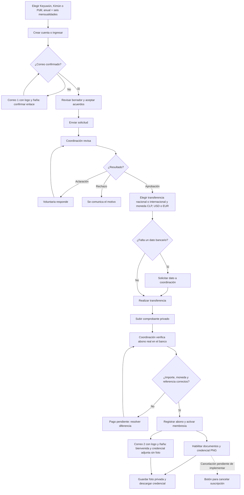

# Diagrama del flujo de voluntariado

Este diagrama acompaña al [manual de funcionamiento](manual-funcionamiento-voluntariado.md). Las flechas continuas describen el flujo preparado en el código local. La flecha punteada señala la cancelación solicitada para una etapa posterior.

**Lectura clave:** la voluntaria recibe dos correos en el recorrido normal. Subir un comprobante no activa la membresía: coordinación verifica el abono y activa. La bienvenida adjunta la credencial inicial sin foto y enlaza el panel; en Mis documentos están el comprobante, el protocolo y la credencial actualizada. Los avisos a coordinación se conservan. El botón de cancelación todavía no existe en la interfaz publicada ni en el código local.
